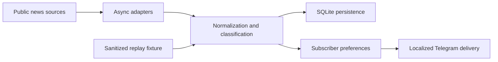
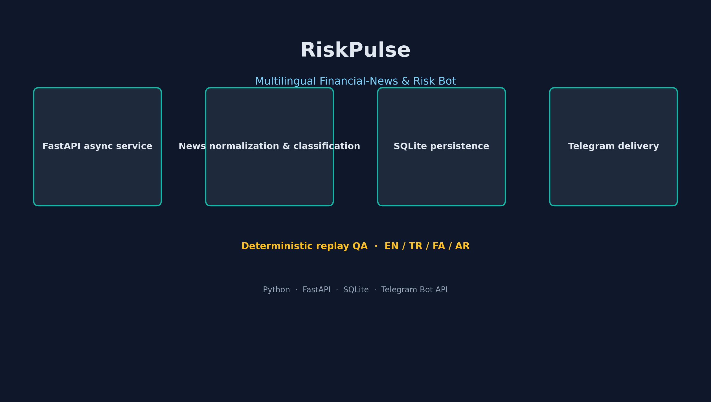
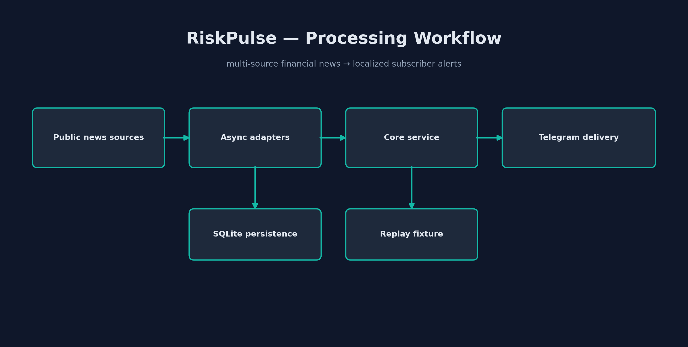

# RiskPulse - Financial News Risk Bot

> A public-safe Python/FastAPI showcase for turning multi-source financial news into localized subscriber alerts.

RiskPulse is an async service architecture I engineered around news normalization, risk classification, subscriber preferences, localized Telegram delivery, and replay-oriented QA. This public release contains a safe, deterministic demo contract and documents the original system boundary; production credentials, databases, provider configuration, and operational data are excluded.

## What it demonstrates

- FastAPI and Pydantic-based REST contracts.
- Async news-adapter boundary, SQLite persistence pattern, and Telegram subscriber delivery.
- Multi-language delivery and deterministic replay-test design.
- A security-first configuration model using environment variables.

## Architecture

See [architecture](docs/architecture.md), [system flow](docs/system-flow.md), and the synthetic [example event](examples/news-event.json).

## Safe demo

The included fixture is non-operational: it has no provider tokens, no real endpoints, no subscriber data, and no external network calls. Copy `.env.example` only when building a private local integration; use your own credentials.

## Excluded deliberately

Production Telegram tokens, API keys, provider settings, live endpoints, databases, logs, subscriber records, and operational risk thresholds.

## Visual overview

## Screenshots

No screenshots are included because live alerts can contain subscriber and operational information. The examples directory is the public demonstration material.

## License

MIT for this showcase documentation and synthetic fixtures. The production deployment configuration and data are not included.
